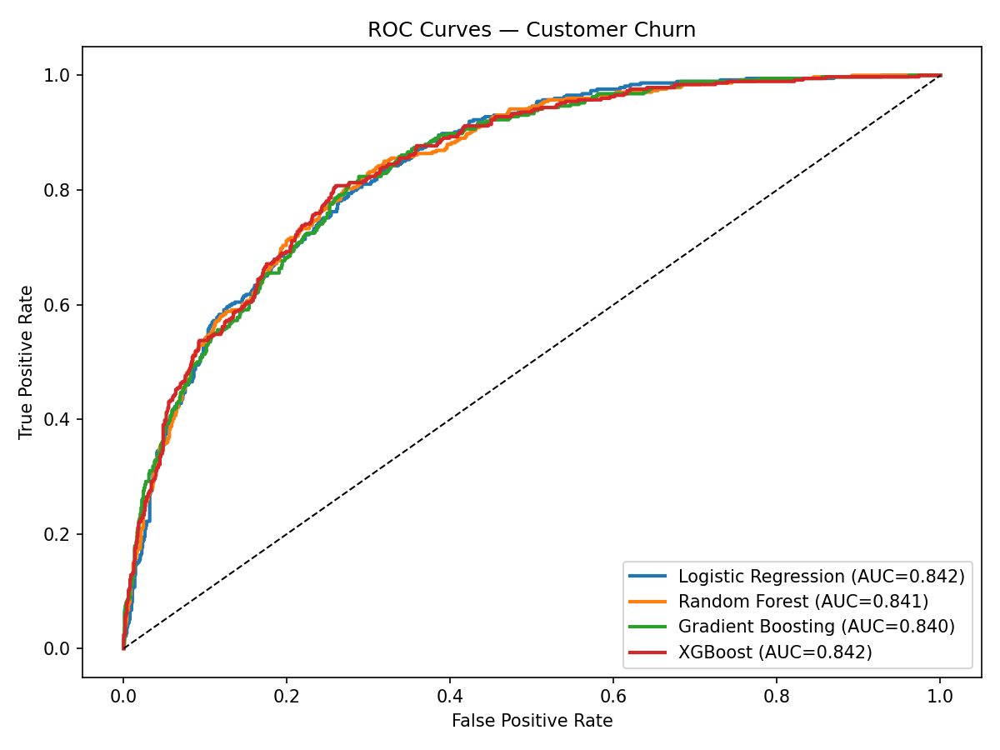
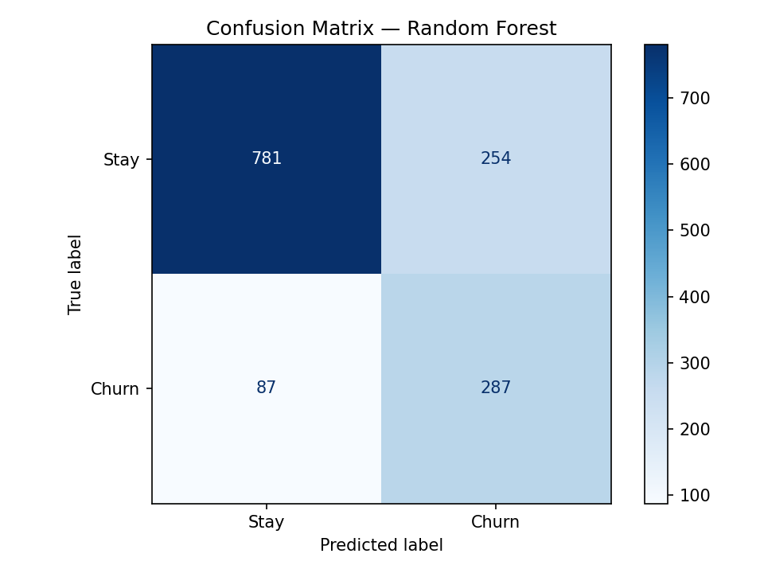
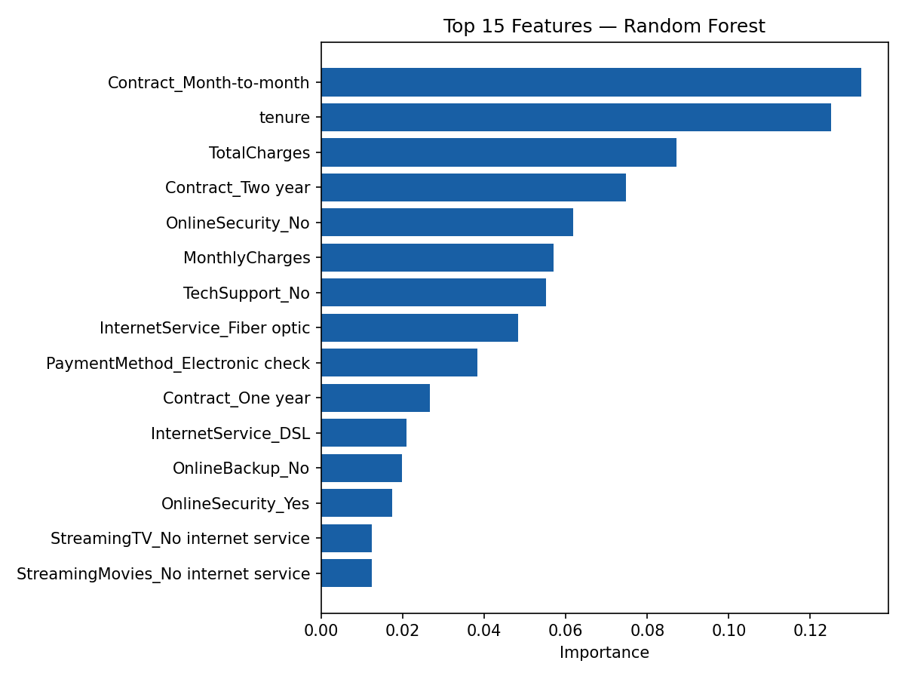
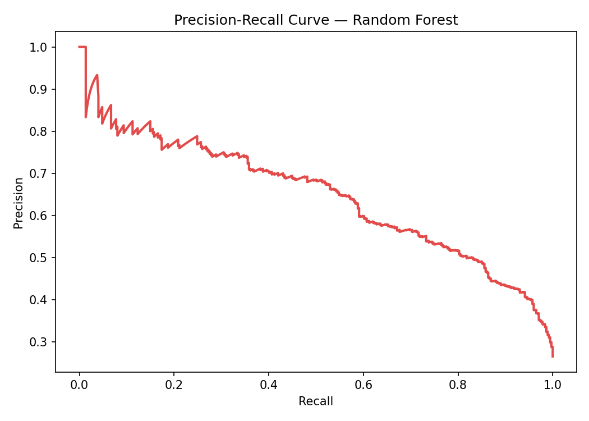

# 📉 Customer Churn Prediction System

> End-to-end machine learning pipeline to predict telecom customer churn — featuring multi-model benchmarking, feature importance analysis, and a REST API for real-time scoring.


---

## 🎯 Project Overview

This project builds a binary classification system to identify telecom customers at risk of churning. Four machine learning models were trained, evaluated, and compared — with Random Forest selected as the final model based on its precision-recall trade-off for business-critical churn detection.

The pipeline covers the full ML lifecycle: data preprocessing → feature engineering → model training → evaluation → REST API deployment.

---

## 📊 Model Performance

Four models were benchmarked on the same test set:

| Model | AUC-ROC | Notes |
|---|---|---|
| Logistic Regression | **0.842** | Strong baseline, interpretable |
| XGBoost | **0.842** | Best raw AUC, tied with LR |
| Random Forest | 0.841 | Selected for deployment (best precision at low FPR) |
| Gradient Boosting | 0.840 | Close competitor |

### Confusion Matrix — Random Forest (Test Set)

|  | Predicted: Stay | Predicted: Churn |
|---|---|---|
| **Actual: Stay** | 781 ✅ | 254 ❌ |
| **Actual: Churn** | 87 ❌ | 287 ✅ |

- **Churn Recall:** 287 / (287 + 87) = **76.7%** — model catches 3 in 4 churners
- **Churn Precision:** 287 / (287 + 254) = **53.0%**
- **Overall Accuracy:** (781 + 287) / 1409 = **75.8%**

> The precision-recall curve shows precision above 80% is achievable at recall ≤ 0.08, making the model suitable for targeted high-value customer retention campaigns.

---

## 🔍 Key Findings — Feature Importance

Top predictors of churn identified by Random Forest:

1. **Contract type (Month-to-month)** — highest importance (0.130+); month-to-month customers churn at significantly higher rates
2. **Tenure** — longer-tenured customers are far less likely to churn (0.125)
3. **Total Charges** — strong proxy for customer lifetime value (0.088)
4. **Two-year contract** — strong negative churn signal (0.075)
5. **Online Security (No)** — customers without security add-ons churn more (0.062)
6. **Monthly Charges** — pricing sensitivity drives churn (0.057)
7. **Tech Support (No)** — lack of support correlates with dissatisfaction (0.055)
8. **Internet Service (Fiber optic)** — fiber customers show higher churn rates (0.048)

> **Business insight:** Contract type and tenure together account for ~25% of the model's predictive power. Retention efforts should focus on converting month-to-month customers to annual contracts early in their lifecycle.

---

## 🗂️ Project Structure

```
customer-churn-prediction/
│
├── data/
│   ├── raw/                    # Original Telco dataset
│   └── processed/              # Cleaned, encoded features
│
├── notebooks/
│   ├── 01_eda.ipynb            # Exploratory data analysis
│   ├── 02_preprocessing.ipynb  # Feature engineering pipeline
│   └── 03_modelling.ipynb      # Model training & evaluation
│
├── src/
│   ├── preprocess.py           # Data cleaning & encoding
│   ├── train.py                # Model training script
│   ├── evaluate.py             # Metrics & visualizations
│   └── predict.py              # Inference utilities
│
├── models/
│   └── churn_model.pkl         # Serialized Random Forest model
│
├── outputs/
│   ├── roc_curves.png
│   ├── confusion_matrix.png
│   ├── feature_importance.png
│   └── precision_recall.png
│
├── app.py                      # FastAPI REST endpoint
├── requirements.txt
└── README.md
```

---

## ⚙️ Tech Stack

| Category | Tools |
|---|---|
| Language | Python 3.9+ |
| ML Models | Scikit-learn, XGBoost |
| Data | Pandas, NumPy |
| Visualization | Matplotlib, Seaborn |
| API | FastAPI / Flask |
| Serialization | Joblib (pkl) |
| Environment | Jupyter Notebook, VS Code |

---

## 🚀 Getting Started

### 1. Clone the repository

```bash
git clone https://github.com/yourusername/customer-churn-prediction.git
cd customer-churn-prediction
```

### 2. Install dependencies

```bash
pip install -r requirements.txt
```

### 3. Run training

```bash
python src/train.py
```

### 4. Start the prediction API

```bash
uvicorn app:app --reload
```

### 5. Make a prediction (sample curl)

```bash
curl -X POST http://localhost:8000/predict \
  -H "Content-Type: application/json" \
  -d '{
    "tenure": 12,
    "contract": "Month-to-month",
    "monthly_charges": 70.5,
    "total_charges": 846.0,
    "internet_service": "Fiber optic",
    "online_security": "No",
    "tech_support": "No"
  }'
```

**Response:**

```json
{
  "churn_prediction": 1,
  "churn_probability": 0.73,
  "risk_level": "High"
}
```

---

## 📈 Evaluation Plots

| ROC Curves (All Models) | Confusion Matrix |
|---|---|
| |  |

| Feature Importance | Precision-Recall |
|---|---|
|  |  |

---

## 📌 Dataset

**Telco Customer Churn** — IBM Sample Dataset  
Source: [Kaggle](https://www.kaggle.com/datasets/blastchar/telco-customer-churn)  
Records: 7,043 customers | Features: 21 | Target: `Churn` (Yes/No)

---

## 🧠 What I Learned

- All four models converged to nearly identical AUC (~0.84), suggesting the dataset's signal ceiling — a common finding in tabular churn data
- Precision-recall trade-off matters more than accuracy for imbalanced churn datasets (~26% positive class)
- Contract type dominates feature importance, validating business intuition about customer commitment
- SHAP values would be the next step for deeper per-prediction explainability

---

## 🔮 Future Improvements

- [ ] Add SHAP explainability dashboard
- [ ] Experiment with class-weight balancing and threshold tuning to improve churn recall
- [ ] Deploy to AWS Lambda with API Gateway for serverless inference
- [ ] Add a Streamlit front-end for non-technical business users
- [ ] Retrain monthly with fresh data using a scheduled pipeline (Airflow / GitHub Actions)

---

## 👤 Author

**D.Nisith**  
B.Tech CSE (AI & ML) — Dayananda Sagar University  
[LinkedIn](https://linkedin.com/in/yourprofile) · [GitHub](https://github.com/yourusername)

---

